# Results Summary

This document summarizes the curated results of the MetRep endocrine-metabolic
model portfolio. The analysis follows one diagnostic chain:

```text
local sensitivity
-> biological admissibility filtering
-> global sensitivity
-> SVD identifiability
-> profile likelihood
-> uncertainty propagation
-> Bayesian experimental design
-> Bayesian posterior updating
```

The central conclusion is that Bayesian updating is broadly consistent with
the identifiability diagnosis: identifiable parameters tend to narrow more
strongly, boundary-limited parameters update partially, and weak/flat
parameters remain comparatively weakly informed.

## 1. Local Sensitivity Analysis


*Figure 1. AUC-based one-at-a-time local sensitivity ranking. Blue indicates
positive AUC response and orange indicates negative AUC response.*

Figure 1 ranks parameters by their cumulative effect on output AUCs rather
than by their effect at a single time point. This is important for an
oscillatory endocrine-metabolic model because one arbitrary day can fall in a
follicular phase, luteal phase, transition period, or pulse event.

The strongest local responses involve glucose-insulin regulation, IGF
dynamics, and reproductive endocrine mechanisms. High-ranking examples include
`insulin_glucose_threshold`, `blood_usage_glucose_threshold`,
`blood_to_liver_glucose_threshold`, `igf_clearance`, `cl_to_p4_scale`,
`cl_formation_scale`, `insulin_secretion_max`, and `insulin_clearance`.

This screen identifies which mechanisms move the model outputs. It does not
by itself determine which parameters can be uniquely estimated, because a
sensitive parameter may still be compensated by other parameters.

## 2. Biological Admissibility Filtering

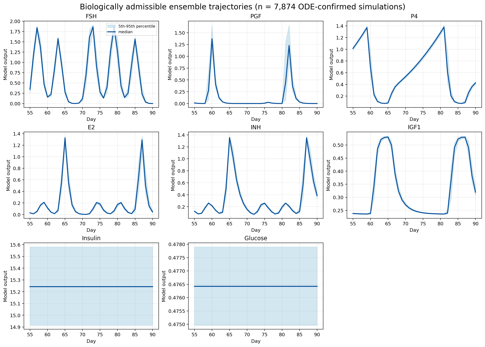

*Figure 2. Biologically admissible ODE trajectory envelope for the historical
admissibility panel. Lines show the ensemble median and shaded regions show
the 5th-95th percentile range.*

Figure 2 shows the biologically admissible trajectory envelope used to check
whether parameter samples produce plausible endocrine-metabolic behavior. The
filter removes simulations with invalid numerical outputs or implausible
trajectory shape before ensemble-level analyses are interpreted.

Only ODE-confirmed admissible rows are treated as scientific truth. The
historical admissibility filter used FSH, PGF, P4, E2, INH, IGF1, insulin, and
glucose. Glucagon was excluded from that filter but retained as an observable
biomarker for downstream uncertainty propagation, global sensitivity, and BED.

## 3. Global Sensitivity Analysis

The global sensitivity heatmaps should be read as parameter-biomarker
association maps. PRCC and Spearman summarize monotonic links between
parameters and observable biomarker AUCs across the ODE-confirmed admissible
ensemble. These are association screens, not strict Sobol variance
decompositions.


*Figure 3. Strongest PRCC associations between parameters and biomarker AUCs.*

Figure 3 shows that metabolic threshold and transport parameters preferentially
associate with glucose, insulin, IGF1, and glucagon AUCs. Reproductive
mechanisms preferentially associate with FSH, PGF, P4, E2, and INH AUCs.
Coupled links appear because the model connects metabolic and reproductive
endocrine regulation.


*Figure 4. PRCC associations for the representative 3 x 3 profile-likelihood
parameter set.*

Figure 4 connects the representative identifiable, boundary-limited, and
weak/flat parameters to candidate observable biomarkers. These links guide BED
by indicating which biomarkers are plausible observation targets for each
parameter. Full 98 x 9 PRCC and Spearman maps are provided in the Appendix.

## 4. SVD Identifiability

The SVD analysis separates informed parameter directions from weak or
compensatory directions. The singular-value spectrum in Figure 5 shows how
rapidly information drops across directions. The compensation network in
Figure 6 highlights parameter trade-offs. The decision map in Figure 7 combines
sensitivity and compensation to separate estimate, fix-anchor, and
fix-irrelevant candidates.


*Figure 5. Singular-value spectrum of the measurable-output sensitivity
matrix.*


*Figure 6. Dominant compensation edges inferred from weak local directions.*

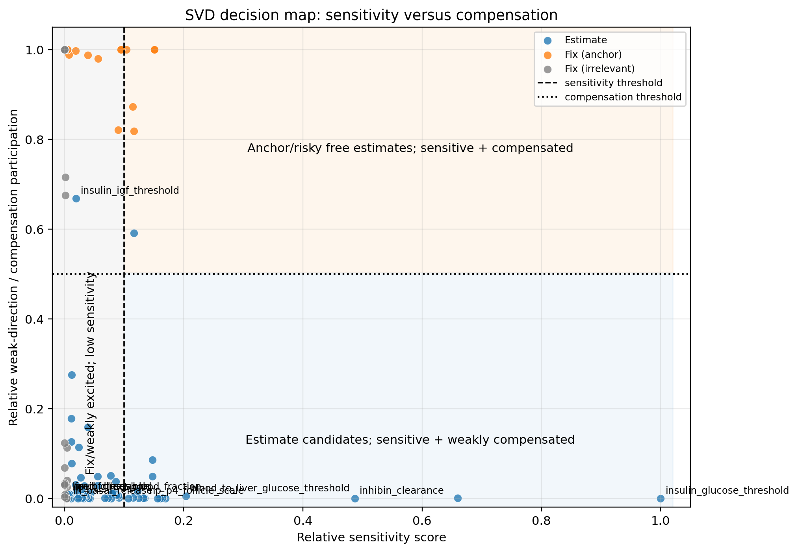

*Figure 7. SVD decision map with sensitivity and compensation thresholds.
The lower-right region contains the strongest estimate candidates.*

Figure 7 makes the key distinction explicit. Sensitive and weakly compensated
parameters are the best estimation candidates. Sensitive but highly
compensated parameters are biologically important but risky to estimate freely
because other parameters can mimic their effects. Low-sensitivity parameters
are poor calibration targets in this experiment, and weakly sensitive but
compensatory parameters should usually remain fixed unless a new experiment
excites them.

Representative estimate candidates include `insulin_glucose_threshold`,
`inhibin_clearance`, `blood_to_liver_glucose_threshold`, and
`hp_p4_follicle_scale`.

## 5. Profile Likelihood


*Figure 8. Representative profile-likelihood classes for three practically
identifiable, three boundary-limited, and three weak/flat parameters.*

Figure 8 is the nonlinear confirmation step. Profile likelihood tests whether
the local SVD diagnosis persists when nuisance parameters can re-adjust over a
wider parameter range.

The top row shows bounded minima on both sides of the optimum, consistent with
practical identifiability. The middle row shows partial or one-sided
constraint, indicating boundary-limited behavior. The bottom row remains
broad, shallow, or flat, indicating weak learnability under the current
observable panel.

## 6. Uncertainty Propagation


*Figure 9. Reproductive observable uncertainty propagation under admissible
parameter variability.*

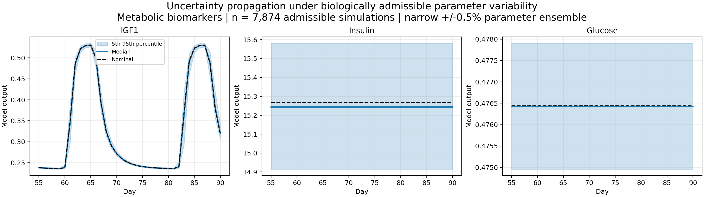

*Figure 10. Metabolic observable uncertainty propagation under admissible
parameter variability.*

Figures 9 and 10 summarize admissible trajectory variability using the
ensemble median, nominal trajectory, and 5th-95th percentile range. Informative
measurement windows correspond to periods where trajectories separate across
plausible parameterizations. These windows are carried into BED so that
biomarker selection and sampling time selection are linked to actual trajectory
variation.

## 7. Bayesian Experimental Design

BED links the diagnostic chain:

```text
profile likelihood class
-> GSA-linked biomarkers
-> uncertainty-selected time windows
-> MI-ranked biomarker/day candidates
-> guided posterior update
```

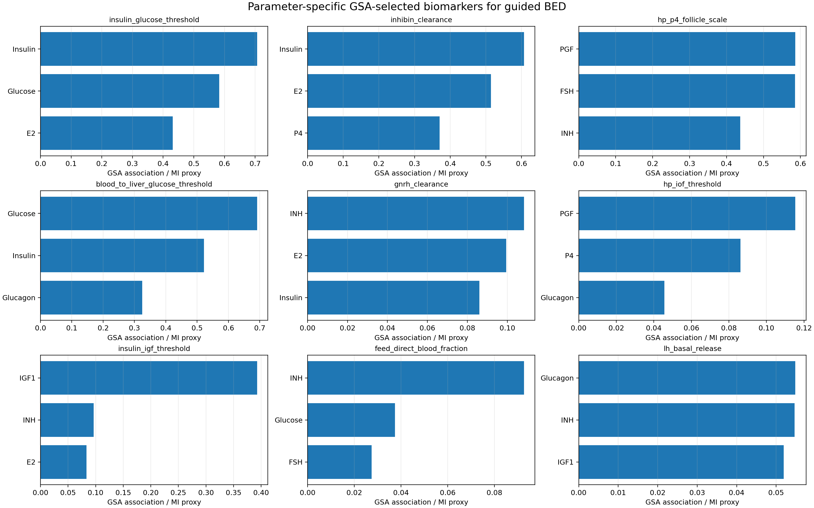

*Figure 11. Parameter-specific biomarker information ranking.*

Figure 11 ranks observable biomarkers by information content for the
representative parameters. The ranking operationalizes the profile-likelihood
and GSA results: profile likelihood identifies which parameters need testing,
GSA identifies plausible biomarkers, and MI ranks the biomarker-day candidates
within uncertainty-informed windows.

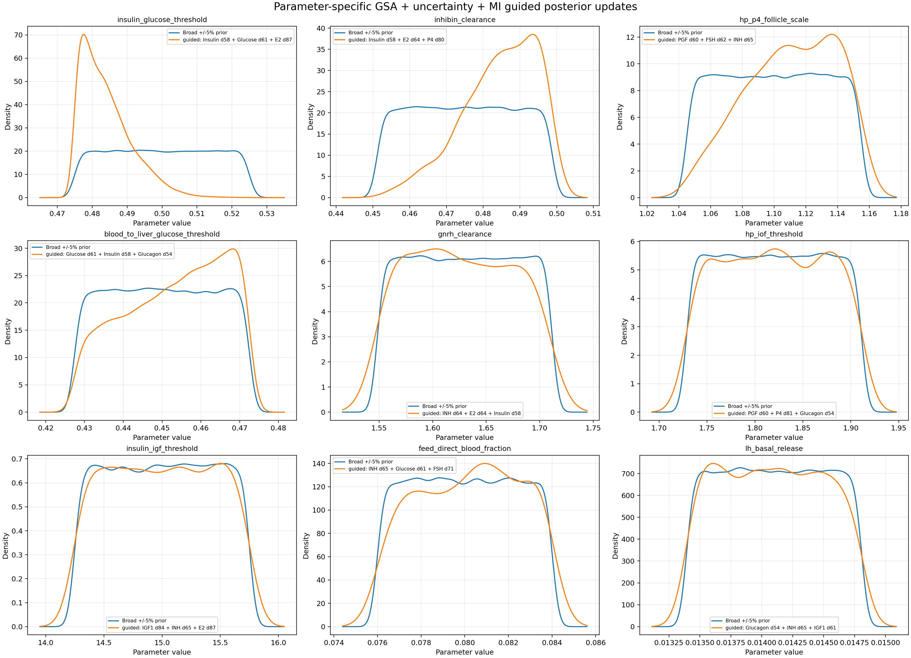

*Figure 12. Guided prior-to-posterior updates using parameter-specific
biomarker-day observations.*

Figure 12 shows that practically identifiable parameters generally undergo
stronger posterior contraction. Boundary-limited parameters update partially
or toward one side of the prior range. Weak/flat parameters often remain broad
because the selected observations do not fully resolve compensation.

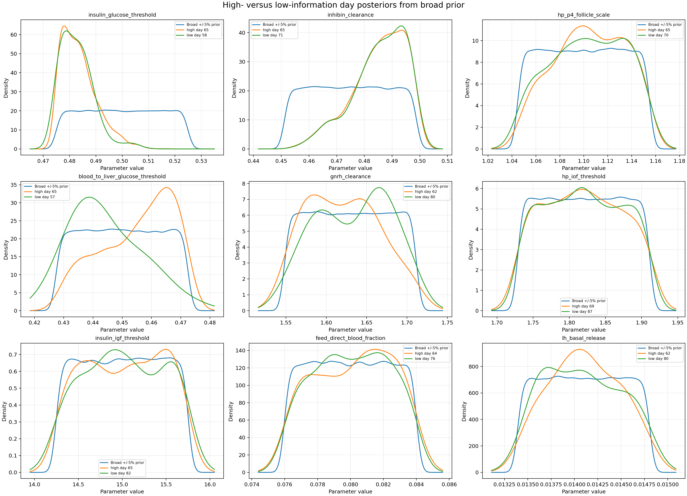

*Figure 13. Posterior comparison between high- and low-information sampling
days.*

Figure 13 checks whether MI-ranked days produce more interpretable posterior
movement than lower-information periods. The comparison supports the central
BED premise: timing matters because the same biomarker can carry different
information in different endocrine phases.

Independent observation scenarios, cumulative biomarker acquisition, and
candidate-day MI curves are provided in the Appendix. Together they document
how posterior learning changes when measurements are added one at a time,
cumulatively, or at different candidate days.

## 8. Bayesian Posterior Updating

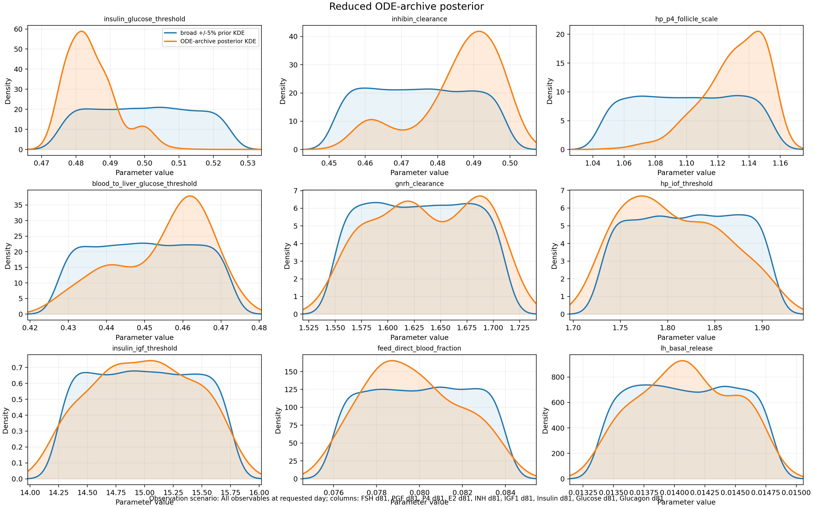

*Figure 14. Reduced ODE-archive posterior using likelihood weights over
precomputed broad-prior simulations.*

The reduced ODE-archive posterior in Figure 14 uses only precomputed ODE rows.
No surrogate-generated trajectories are used as posterior truth, and posterior
support is limited to the saved archive.

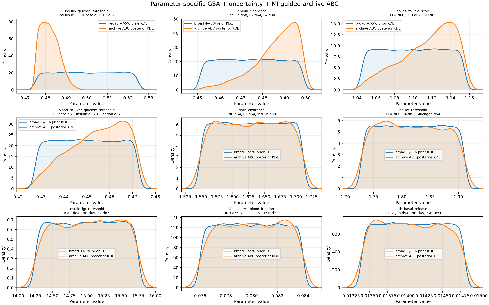

*Figure 15. Archive-based sequential ABC posterior summaries for
parameter-specific guided scenarios.*

Figure 15 shows archive-based sequential ABC filtering. The tolerance is
reduced over precomputed ODE rows, but particles are not perturbed and ODEs are
not rerun. Therefore this is best interpreted as archive-based sequential
filtering rather than full adaptive ABC-SMC.

| Parameter class | Expected posterior behavior | Interpretation |
|---|---|---|
| Practically identifiable | Strong narrowing | Existing outputs contain constraining information |
| Boundary-limited | Partial or one-sided update | Observations constrain only part of the explored range |
| Weak/flat | Broad posterior remains | Measurements do not resolve compensating directions |

The Bayesian method comparison summarizes posterior contraction behavior
across archive-based approximations. It should be interpreted as a consistency
check, not as a competition for a single best method.

## 9. Overall Scientific Interpretation

The complete workflow is internally consistent. Local sensitivity identifies
mechanisms that affect outputs. Biological admissibility filtering restricts
ensemble analyses to plausible ODE behavior. Global sensitivity maps
parameters to biomarkers. SVD separates informed from weak parameter
directions. Profile likelihood confirms identifiable, boundary-limited, and
weak/flat cases. Uncertainty propagation identifies informative time windows.
BED selects biomarker-day observations. Bayesian posterior updating tests
whether those observations reduce uncertainty.

Practically identifiable parameters tend to exhibit stronger posterior
contraction because they are sensitive, weakly compensated, and linked to
informative biomarkers. Boundary-limited parameters often show partial or
one-sided updates because the available measurements constrain only part of
the explored parameter range. Weak or compensatory parameters may remain
broadly distributed even after guided measurements because the current
observable panel does not isolate their effects.

BED improves learning when identifiable information exists, but it does not
artificially resolve parameter directions that remain weak under the available
observable panel.

# Appendix -- Supporting Diagnostic Results

## Global Sensitivity Supplementary Figures

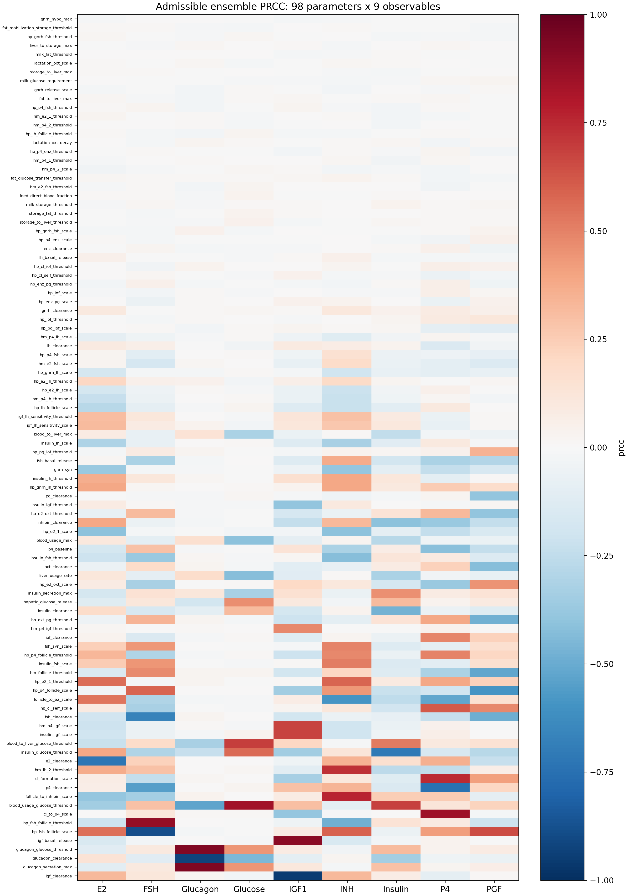

*Appendix Figure A1. Full 98 x 9 PRCC map across analyzed parameters and
observable biomarker AUCs.*

The full PRCC map preserves the complete parameter-biomarker association
screen and supports auditability beyond the compact main-text heatmaps.

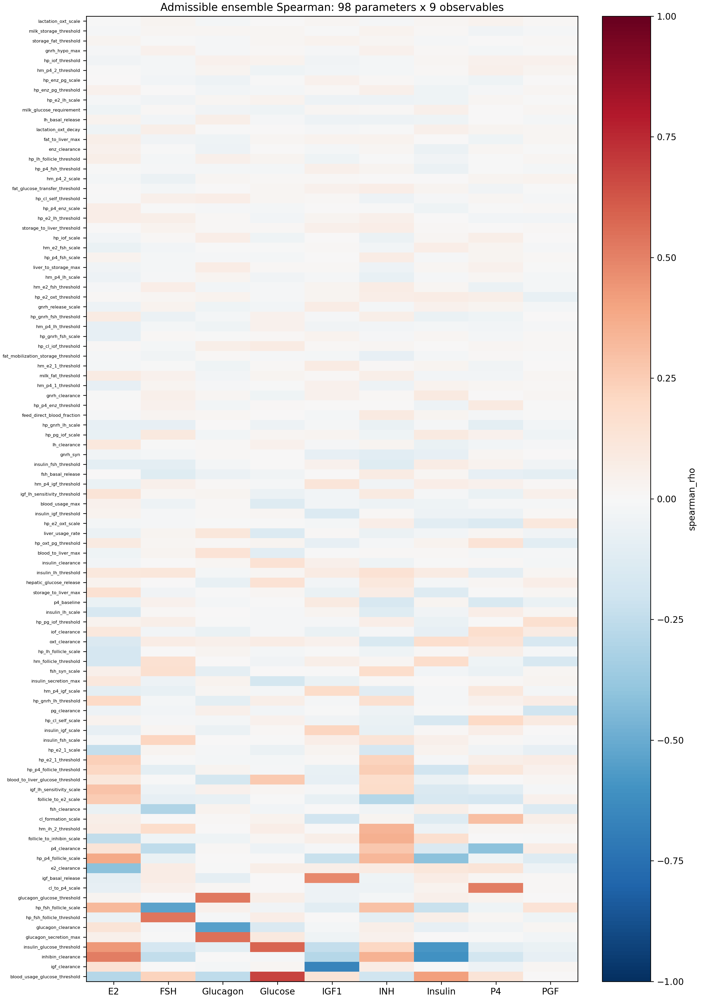

*Appendix Figure A2. Full 98 x 9 Spearman rank-correlation map.*

The Spearman map shows direct rank associations without partialing out other
parameters. Agreement with PRCC supports robust monotonic relationships;
differences indicate associations that may depend on covariance among sampled
parameters.

## BED Supporting Traceability Figures

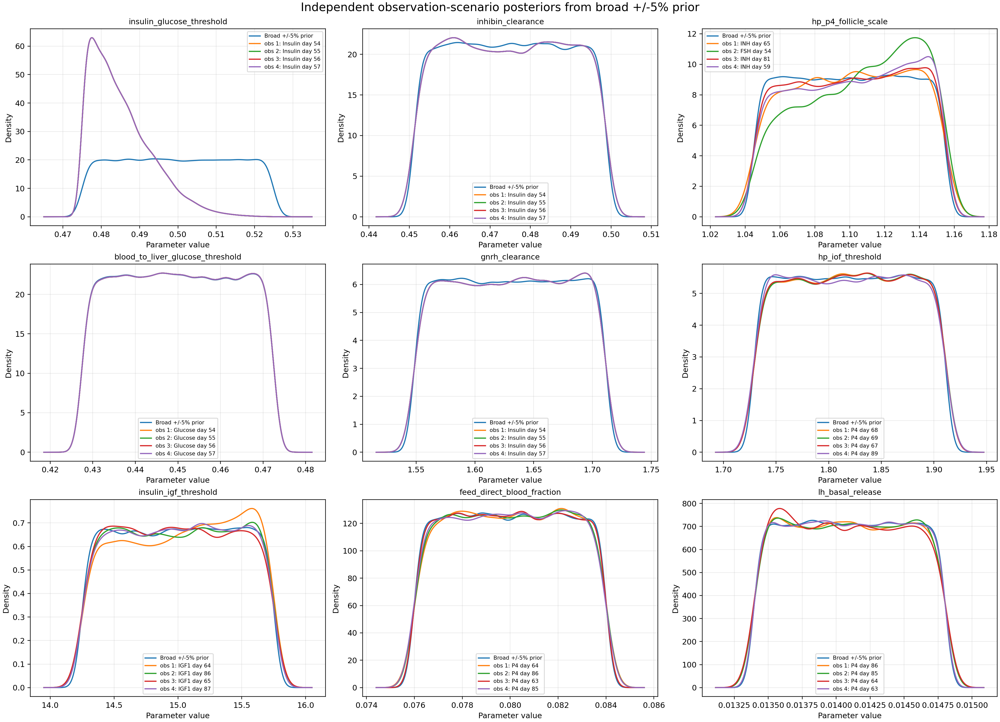

*Appendix Figure A3. Independent observation scenario posterior updates.*

Independent observation scenarios isolate how individual selected
measurements reshape representative parameter priors.

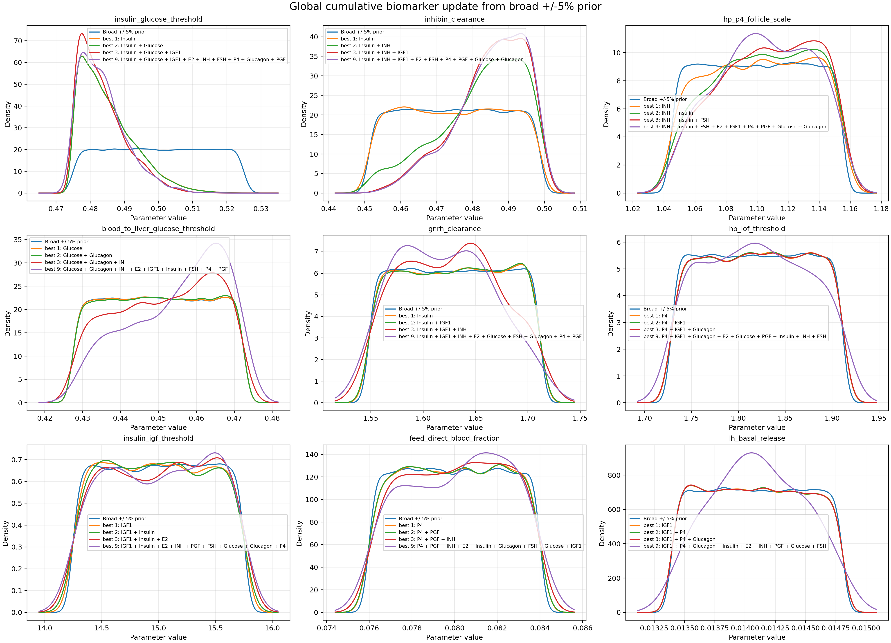

*Appendix Figure A4. Cumulative biomarker acquisition posterior updates.*

The cumulative acquisition analysis adds biomarkers sequentially according to
their ranking and shows how posterior distributions change as additional
measurements are incorporated.

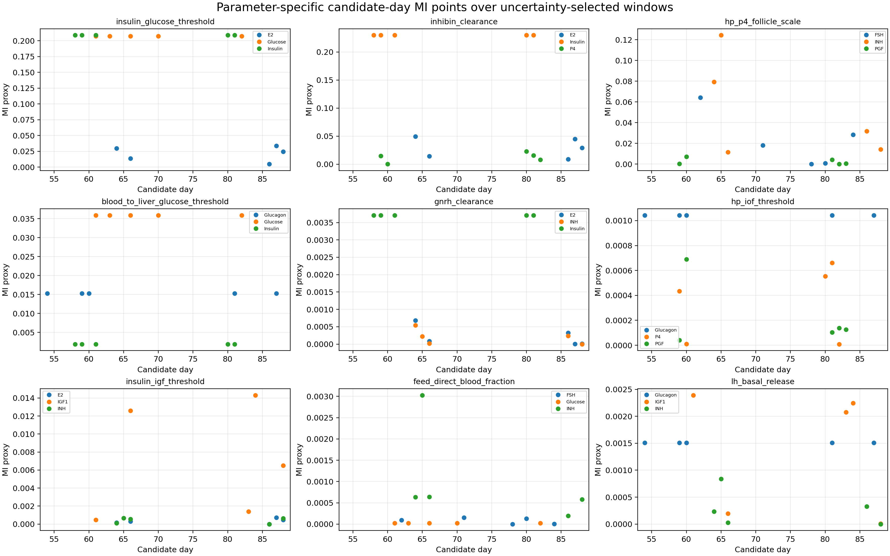

*Appendix Figure A5. Parameter-specific candidate-day MI curves over
uncertainty-selected windows.*

The MI day curves document why representative parameters receive different
biomarker-day observation scenarios and why not all biomarkers share the same
optimal sampling day.
