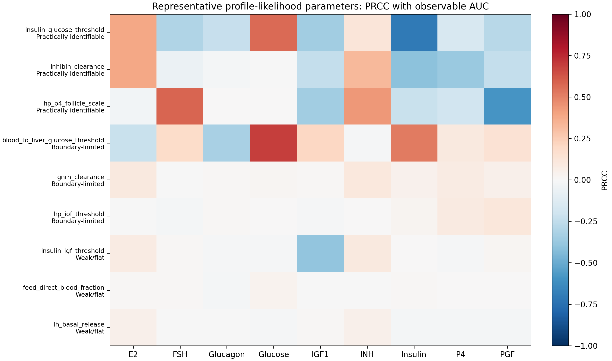

# Results Summary

This summary presents the curated scientific story from the MetRep
metabolic-reproductive model portfolio. The goal is not to list every generated
plot, but to connect the major diagnostics into one interpretation:

```text
sensitivity
-> compensation
-> identifiability
-> uncertainty
-> BED
-> posterior learning
```

The central conclusion is that Bayesian updating confirms the identifiability
diagnosis rather than contradicting it.

## 1. Local Sensitivity

Local sensitivity uses `+1%` one-at-a-time perturbations and AUC endpoints to
rank parameters by nominal output influence.

Main figure:


The strongest local effects are concentrated in metabolic control,
glucose-insulin regulation, IGF dynamics, and reproductive endocrine
parameters. This shows that the observable biomarkers are responsive to both
metabolic and reproductive mechanisms.

However, local sensitivity is only the first screen. A parameter can strongly
move outputs and still be difficult to estimate if another parameter can
compensate for it.

## 2. Biological Admissibility

Monte Carlo simulations were filtered to retain physiologically plausible ODE
trajectories before downstream ensemble analyses. The historical admissibility
filter used:

```text
FSH, PGF, P4, E2, INH, IGF1, Insulin, Glucose
```

Glucagon was excluded from the admissibility rule but retained as an observable
biomarker for downstream global sensitivity, uncertainty propagation, and BED.

The enriched ODE-confirmed admissible bank contains 12,721 biologically
admissible simulations. These rows are used for ensemble-based ranking,
uncertainty summaries, and MI stability. Only ODE-confirmed rows are treated as
scientific truth.

## 3. Global Sensitivity

Global sensitivity evaluates PRCC and Spearman parameter-biomarker AUC
associations across the ODE-confirmed admissible ensemble.

Main figures:




The global sensitivity results identify which observable biomarkers are most
associated with each parameter across plausible biological variability. This is
important because the strongest nominal local-sensitivity outputs are not
always the best global biomarkers for posterior learning.

Biologically, the heatmaps connect mechanisms to output channels. For example,
metabolic thresholds tend to link with glucose, insulin, IGF1, and glucagon
features, while reproductive control parameters link with FSH, PGF, P4, E2, and
INH dynamics.

PRCC and Spearman are interpreted as monotonic association screens, not formal
Sobol variance decompositions.

## 4. SVD Identifiability

The SVD identifiability screen examines which parameter directions are
expressed in the measured output space and which directions are weak or
compensatory.

Main figures:


Rapidly decaying singular values indicate weakly informed directions. The
compensation network shows where parameters can trade off to produce similar
outputs. This explains why sensitivity and identifiability are not identical:
an influential parameter can still be difficult to estimate if compensation is
available.

The SVD screen motivates estimate/fix/anchor decisions and identifies
candidate parameters for nonlinear profile likelihood.

## 5. Profile Likelihood

Profile likelihood confirms practical identifiability by fixing one parameter
over a grid and allowing nuisance parameters to compensate.

Main figure:


The representative 3 x 3 set shows three qualitative classes:

- Practically identifiable parameters show clear profile curvature.
- Boundary-limited parameters show one-sided or edge-constrained learning.
- Weak/flat parameters show broad, shallow, or compensatory profiles.

This profile-likelihood classification becomes the reference diagnosis for the
Bayesian and BED analyses.

## 6. Uncertainty Propagation

Uncertainty propagation summarizes trajectory variability across the
ODE-confirmed admissible ensemble.

Main figure:


The shaded bands show the 5th-95th percentile range, the solid blue line shows
the ensemble median, and the dashed black line shows the nominal trajectory.
Time windows where admissible trajectories diverge are treated as candidate
experimental windows.

These uncertainty windows are not population variability. They are plausible
model variability under the retained biologically admissible parameter regime.

## 7. Bayesian Experimental Design

BED ranks measurements by expected information about uncertain parameters and
then tests whether those measurements narrow posterior distributions.

Main figures:


The BED workflow includes independent observation scenarios, cumulative
biomarker acquisition from best 1 through best 9 biomarkers, highest- versus
lowest-information day comparisons, and parameter-specific guided updates.

The parameter-specific guided update is the most integrated analysis:

```text
profile class
-> GSA-linked biomarkers
-> uncertainty-selected time windows
-> MI-ranked biomarker/day observations
-> posterior update
```

Specific biomarker/day selections are therefore not random. They are chosen
because they are globally associated with the target parameter, occur in
uncertainty-rich windows, and have high MI proxy scores.

The resulting posterior behavior follows the identifiability diagnosis:
practically identifiable parameters narrow strongly, boundary-limited
parameters narrow partially or one-sidedly, and weak/flat parameters remain
broad.

## 8. Bayesian Inference

Bayesian inference is evaluated with archive-based methods that use trusted ODE
simulation rows rather than surrogate-predicted posterior truth.

Main figures:


The reduced archive posterior uses Gaussian likelihood weights over
precomputed ODE rows. Archive-based sequential ABC filtering reduces a distance
tolerance over the same archive. It is not full adaptive ABC-SMC because it
does not perturb particles or rerun ODEs.

These methods provide a transparent posterior check over the broad `+/-5%` ODE
archive. They should not be oversold as live ODE MCMC or adaptive ABC-SMC.

## 9. Cross-Method Scientific Story

The analyses form a coherent chain:

1. Local sensitivity identifies nominally influential mechanisms.
2. SVD reveals compensation and weak output-informed directions.
3. Profile likelihood confirms nonlinear practical identifiability classes.
4. Biological admissibility restricts ensemble analyses to plausible ODE
   trajectories.
5. Global sensitivity links parameters to observable biomarkers.
6. Uncertainty propagation identifies informative time windows.
7. BED selects biomarker-day observations for parameter learning.
8. Bayesian posterior updates test whether those observations actually reduce
   uncertainty.

The final scientific conclusion is:

```text
Bayesian updating confirms the identifiability diagnosis rather than
contradicting it.
```

This matters because BED is not only a plotting exercise. It provides a
mechanistic check on whether new measurements can improve parameter learning.
Where the model contains usable information, posteriors narrow. Where the
profile likelihood is weak or flat, guided observations may still fail to
produce strong learning, revealing the need for richer measurements or model
reparameterization.
