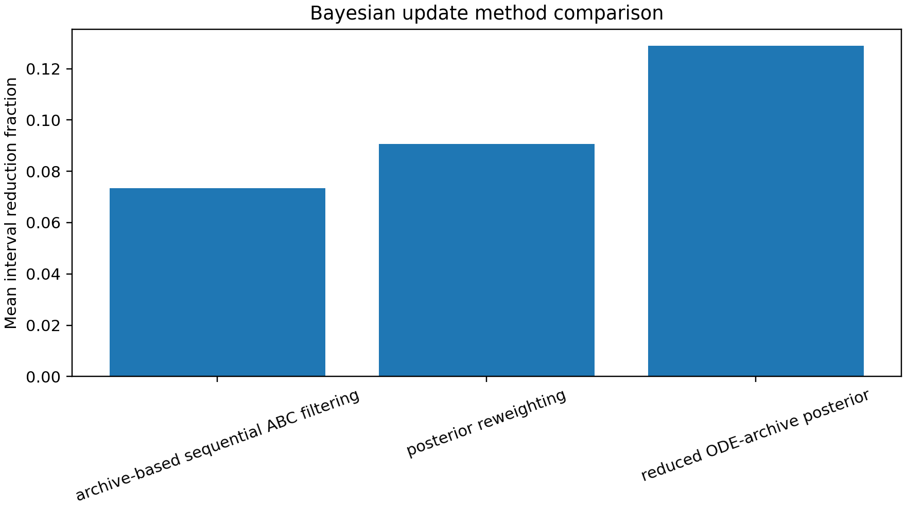

# Results Summary

This document summarizes the curated scientific results for the MetRep
metabolic-reproductive model portfolio. The results are organized as a single
diagnostic chain:

```text
sensitivity
-> compensation
-> identifiability
-> uncertainty
-> BED
-> posterior learning
```

The central scientific conclusion is that Bayesian updating confirms the
identifiability diagnosis rather than contradicting it.

## 1. Local Sensitivity Analysis


Local sensitivity ranks parameters by one-at-a-time AUC response near the
calibrated parameter vector. The strongest effects involve metabolic control,
glucose-insulin regulation, IGF dynamics, and reproductive endocrine
mechanisms. This confirms that the selected observable panel responds to both
metabolic and reproductive subsystems.

Using AUC rather than a single time point is important for this model because
the reproductive-metabolic trajectories are dynamic and partially oscillatory.
The AUC endpoint summarizes sustained trajectory changes while avoiding a
ranking that depends on one arbitrary sampling time.

The result is local by design. It identifies influential mechanisms near the
nominal model, but it does not establish whether those parameters can be
estimated uniquely. Compensation and weak output directions are addressed by
the identifiability analyses.

## 2. Biological Admissibility Filtering

Biological admissibility filtering restricts ensemble analyses to plausible ODE
trajectories. This matters because nonlinear endocrine-metabolic systems can
produce unrealistic oscillations, unstable biomarker levels, or failed cycle
structure even when sampled parameters remain inside a nominal prior range.

The historical admissibility panel used FSH, PGF, P4, E2, INH, IGF1, insulin,
and glucose. Glucagon was excluded from the admissibility rule but retained as
an observable biomarker for downstream uncertainty propagation, global
sensitivity, and Bayesian experimental design.

The enriched ODE-confirmed admissible ensemble contains 12,721 biologically
admissible simulations. Only ODE-confirmed rows are treated as scientific
truth. The admissible ensemble provides the basis for global sensitivity,
uncertainty propagation, and MI/BED ranking stability.


## 3. Global Sensitivity Analysis


Global sensitivity evaluates parameter-biomarker AUC associations across the
ODE-confirmed admissible ensemble. PRCC and Spearman heatmaps show which
parameters are monotonically associated with each observable biomarker.

Metabolic thresholds and transport parameters tend to associate with glucose,
insulin, IGF1, and glucagon AUC features. Reproductive endocrine parameters
link to FSH, PGF, P4, E2, and INH features. These links define biologically
interpretable parameter-biomarker relationships for downstream BED targeting.

The associations are not causal effects and are not formal Sobol variance
decompositions. They are monotonic screening signals inside the admissible
simulation ensemble.

## 4. SVD Identifiability


The SVD screen evaluates which local parameter directions are expressed in the
measured output space. Rapidly decaying singular values indicate weakly
informed directions. Nullspace participation identifies parameters that
contribute strongly to poorly informed directions.

The singular-value pattern shows that the model has a mixture of well-informed
and poorly informed parameter combinations. This is the main reason the
analysis separates "influential" from "identifiable": a parameter can move an
output locally while still being difficult to estimate if another mechanism can
produce a similar trajectory change.

The compensation network shows how parameters can trade off while preserving
similar output behavior. Biologically, this reflects the fact that multiple
mechanisms can influence the same endocrine-metabolic trajectories. This is why
local influence does not automatically imply practical identifiability.

The decision map summarizes which parameters are candidates for estimation,
anchoring, or fixing in a selected output scenario.

## 5. Profile Likelihood


Profile likelihood provides nonlinear confirmation of practical
identifiability. The representative 3 x 3 panel contains:

- Practically identifiable parameters:
  `insulin_glucose_threshold`, `inhibin_clearance`,
  `hp_p4_follicle_scale`.
- Boundary-limited parameters:
  `blood_to_liver_glucose_threshold`, `gnrh_clearance`,
  `hp_iof_threshold`.
- Weak or flat parameters:
  `insulin_igf_threshold`, `feed_direct_blood_fraction`,
  `lh_basal_release`.

Practically identifiable profiles show clear curvature around the optimum.
Boundary-limited profiles show partial or one-sided support. Weak/flat profiles
remain broad or shallow, indicating limited learnability under the available
observable panel.

This nonlinear check complements the SVD screen: SVD identifies weak local
directions and compensation structure, while profile likelihood tests whether
those weaknesses remain after nuisance parameters are allowed to re-adjust over
a wider parameter range.

This classification becomes the reference diagnosis for BED and Bayesian
posterior comparisons.

## 6. Uncertainty Propagation


Uncertainty propagation summarizes the 5th-95th percentile range, ensemble
median, and nominal trajectory across admissible ODE-confirmed simulations.
The informative windows are periods where biologically plausible trajectories
separate meaningfully.

These windows are used by BED to restrict candidate sampling days. The
uncertainty results therefore connect admissible model variability to
experimental timing.

## 7. Bayesian Experimental Design

### Independent Observation Scenarios


Independent observation scenarios show how individual selected measurements
reshape representative parameter priors. These plots separate direct
single-scenario learning from cumulative acquisition effects.

### Cumulative Biomarker Acquisition


The cumulative acquisition analysis adds biomarkers from best 1 through best 9
using a global biomarker ranking. It shows how posterior narrowing changes as
additional measurements are included. This is intentionally different from the
parameter-specific guided update.

### High Versus Low Information Day


The high-versus-low day comparison tests whether BED-ranked sampling days
produce stronger posterior narrowing than less informative days. The result
connects the MI ranking to posterior behavior.

### Guided Parameter-Specific Updates


The guided update is parameter-specific. For each representative parameter, the
workflow selects biomarkers from global sensitivity links, restricts days to
uncertainty-rich windows, ranks biomarker-day candidates by MI, and updates the
posterior using the selected scenario.

This creates the following chain:

```text
profile class
-> GSA-linked biomarkers
-> uncertainty-selected days
-> MI-ranked biomarker/day observations
-> posterior update
```

Conceptually, this is the thesis connection between identifiability and
experimental design. Identifiability diagnostics identify which parameter
directions are weak under the current observation set; BED then asks which
future biomarker-day measurements are most likely to reduce those weaknesses.

Examples include insulin/glucose-related observations for metabolic threshold
parameters and PGF/FSH/INH/P4-related observations for reproductive endocrine
parameters. These selections are not random; they reflect the intersection of
global sensitivity, uncertainty propagation, and MI ranking.

### MI Biomarker Ranking


The biomarker MI bars identify which observable biomarkers are most informative
for each representative parameter. This helps explain why different parameters
receive different guided observation scenarios.

### MI Day Curves


The day curves show candidate-day information scores within
uncertainty-selected windows. Because each parameter has its own linked
biomarkers and uncertainty windows, the selected days can differ across
parameters.

## 8. Bayesian Inference

### Reduced Archive Posterior


The reduced archive posterior uses likelihood weights over broad-prior ODE
archive rows. It is an archive-based posterior approximation, not live ODE
MCMC. The resulting posterior curves provide a transparent check on whether
the selected observations concentrate probability in parameter space.

### Archive ABC Filtering


Archive-based sequential ABC filtering reduces a distance tolerance over
precomputed ODE rows. It is not full adaptive ABC-SMC because particles are not
perturbed and ODEs are not rerun. The method cannot discover posterior regions
absent from the archive, but it provides a likelihood-free check using trusted
ODE simulations.

### Bayesian Method Comparison



The method comparison summarizes posterior behavior across reweighting,
reduced archive posterior updates, and archive-based sequential ABC filtering.
Agreement across these archive-based methods strengthens the final
interpretation.

## 9. Integrated Scientific Story

The results form a coherent scientific chain:

1. Local sensitivity identifies mechanisms that affect outputs near the nominal
   model.
2. SVD identifies weak directions and compensatory parameter combinations.
3. Profile likelihood confirms which representative parameters are practically
   identifiable, boundary-limited, or weak/flat.
4. Biological admissibility filtering restricts ensemble analyses to plausible
   ODE trajectories.
5. Global sensitivity links parameters to observable biomarkers.
6. Uncertainty propagation identifies informative sampling windows.
7. BED selects biomarker-day observations for parameter learning.
8. Bayesian posterior updates test whether those observations reduce
   uncertainty.

Practically identifiable parameters show strong posterior narrowing.
Boundary-limited parameters show partial or one-sided learning. Weak/flat
parameters remain broad even under guided observations.

Bayesian updating confirms the identifiability diagnosis rather than
contradicting it.
