# Results Summary

This document summarizes the main modelling diagnostics and curated results for the BovSys/MetRep metabolic-reproductive model repository.

The repository focuses on the reproducible Python workflow around the mechanistic ODE model: baseline simulation, local sensitivity analysis, identifiability diagnostics, profile-likelihood confirmation, global sensitivity screening, uncertainty propagation, and Bayesian experimental design.

The full biological scenario simulations are described in the MetRep model paper, the dexamethasone perturbation workflow is described in the Dexa model paper, and the original Bayesian experimental design analysis is reported in the PhD thesis. This repository does not attempt to replace those original reports. Instead, it curates the model code, reproducible analysis scripts, and selected figures that demonstrate the modelling workflow.

The analyses are complementary:

- Local sensitivity identifies parameters with strong nominal influence on output trajectories.
- SVD identifiability and compensation analysis reveal which parameter directions are informed or weakly informed by the selected outputs.
- Profile likelihood confirms nonlinear practical identifiability for selected parameters.
- Global sensitivity / PRCC-Spearman screening evaluates parameter-biomarker associations across simulation-bank ensembles.
- Uncertainty propagation quantifies local robustness under biologically admissible parameter variability.
- Bayesian experimental design identifies informative future measurements for reducing parameter uncertainty.

For technical definitions and formulas, see:

- `docs/methodology.md`
- `docs/plot_interpretation_guide.md`
- `analyses/bayesian_experimental_design/`

---

## Result Set

| Step | Main question | Main output | Appendix / diagnostic output |
|---|---|---|---|
| Python validation | Does the Python translation preserve model metadata and simulate correctly? | results_final/tables/validation_report.csv, results_final/figures/baseline_selected_states.png | results_final/figures/baseline_all_states.png |
| Sensitivity | Which parameters most strongly affect selected outputs? | results_final/figures/sensitivity_top_parameters.png, results_final/tables/sensitivity_top_parameters.csv | — |
| SVD identifiability | Which parameter directions are informed or weakly informed? | results_final/figures/identifiability_singular_values.png | results_final/figures/identifiability_svd_ranking.png |
| Estimate/fix decision | Which parameters should be estimated, anchored, or fixed? | results_final/figures/identifiability_decision_map.png, results_final/tables/structid_50d_measurable_holistic_table.csv | results_final/figures/identifiability_class_counts.png |
| Compensation | Which parameters compensate each other? | results_final/figures/identifiability_compensation_network_core.png, results_final/figures/identifiability_parameter_scenario_map.png | results_final/figures/identifiability_compensation_edges.png, results_final/figures/identifiability_nullspace_participation_all_parameters.png, results_final/figures/identifiability_sensitivity_vs_nullspace_all_parameters.png, results_final/figures/identifiability_sensitivity_ranked_by_class.png |
| Profile likelihood | Do selected parameters remain identifiable under nonlinear profiling? | results_final/figures/profile_likelihood_representative_3x3.png, results_final/tables/profile_50d_balanced_relaxed_summary.csv | results_final/figures/profile_50d_balanced_synthetic_outputs.png |
| Surrogate BED pilot | Which sampling day/species panel is informative, and how much faster is the surrogate? | Bayesian_Experimental_Design/surrogate_bed/run_outputs/figures/surrogate_bed_thesis_style_summary.png | Bayesian_Experimental_Design/surrogate_bed/run_outputs/figures/surrogate_bed_ode_vs_surrogate_speed.png |
| Dexa perturbation | Does the optional Dexa extension produce a pharmacological perturbation response? | results_final/figures/dexa_non_lactating_standard_3d_summary.png, results_final/tables/dexa_non_lactating_standard_3d_response_summary.csv | MATLAB reference: MetRep_Matlab/BovSys_run_dexa_v3.m |

---

# Main Results

## 1. Baseline Python Model Validation

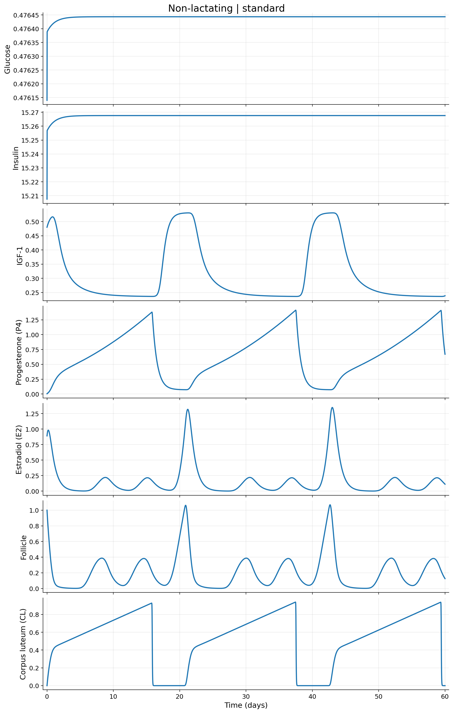

The baseline simulation is used as a functional check of the translated Python model before sensitivity, identifiability, profile likelihood, or BED analyses are interpreted. It is not itself an identifiability test. Its purpose is to confirm that the translated model produces biologically plausible trajectories for the selected metabolic and reproductive states.

Baseline selected states

The selected-state baseline panel should be used in the main report because it gives a readable overview of the key model outputs. The full 22-state panel is useful as a technical completeness check, but it is too dense for the main narrative and is therefore better placed in the appendix.

---

## 2. Local Sensitivity Screening

Top local sensitivity parameters

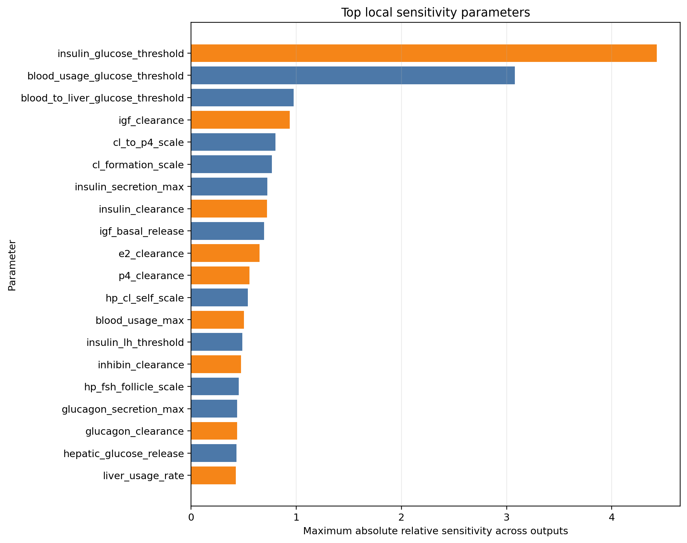

The local sensitivity screen ranks parameters by their effect on output AUCs. Instead of evaluating sensitivity at a single arbitrary time point, the AUC-based score summarizes the cumulative trajectory response over the simulation window. This is useful for an oscillatory endocrine-metabolic model because a single time point can be misleading if the system is in a follicular phase, luteal phase, transition period, or pulse event.

The strongest AUC-level responses are concentrated in glucose-insulin regulation, IGF dynamics, and reproductive steroid-related parameters. The highest-ranking parameters include insulin_glucose_threshold, blood_usage_glucose_threshold, blood_to_liver_glucose_threshold, igf_clearance, cl_to_p4_scale, cl_formation_scale, insulin_secretion_max, and insulin_clearance.

This result indicates that the selected outputs are responsive to both metabolic control parameters and reproductive endocrine parameters. However, sensitivity alone is not sufficient for parameter estimation. A parameter can strongly affect the model outputs and still be difficult to estimate if another parameter can compensate for it.

PS: Blue = positive sensitivity. Orange = negative sensitivity

---

## 3. SVD Identifiability Spectrum

Singular values

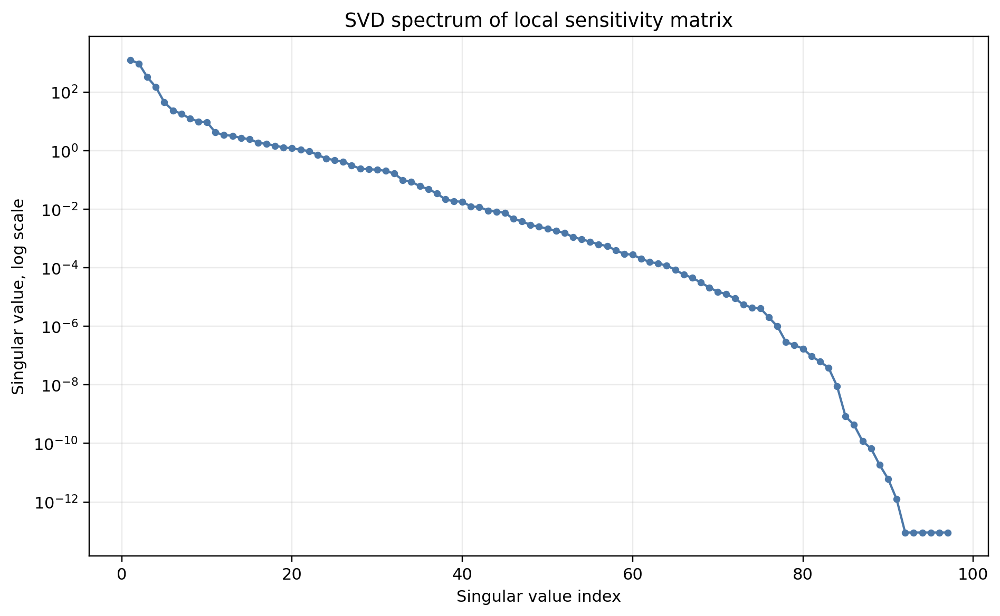

The singular-value spectrum summarizes the information content of the local trajectory sensitivity matrix. Large singular values correspond to well-informed parameter directions, while very small singular values correspond to weakly informed or practically non-identifiable directions.

The spectrum spans many orders of magnitude, with the largest singular value around 1.27e3 and the smallest values around 9.04e-14. This large numerical spread indicates that the selected measurement panel informs some combinations of parameters strongly, while leaving other combinations weakly determined.

The interpretation is not that the entire model is identifiable or non-identifiable. Instead, the model contains a mixture of well-informed and poorly informed parameter directions. This motivates the next step: identifying which individual parameters are sensitive, which participate in weak directions, and which should be estimated, anchored, or fixed.

---

## 4. Estimate, Anchor, and Irrelevant Parameter Classes

Decision map

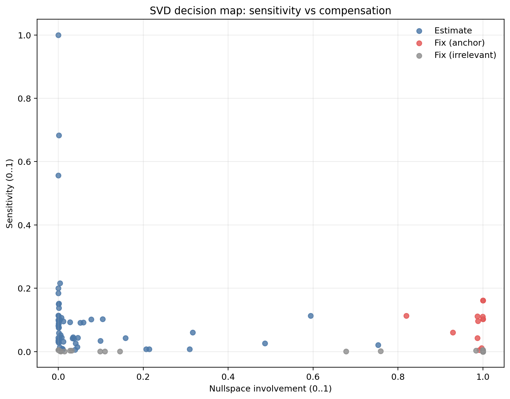

The decision map combines two pieces of information:

- Sensitivity: does the parameter affect the selected outputs?
- Nullspace involvement: does the parameter participate in weak or compensatory directions?

This distinction is essential because high sensitivity does not automatically mean good estimability. A parameter is a good estimation candidate only if it affects the outputs and is not strongly confounded with other parameters.

Using measurable outputs FSH, PGF, P4, E2, INH, IGF1, Insulin, Glucose, Glucagon, the SVD screen classified the analyzed parameters as:

- 60 Estimate
- 12 Fix (anchor)
- 25 Fix (irrelevant)

The Estimate group contains parameters that are sufficiently sensitive and have low enough nullspace participation to be reasonable calibration or profile-likelihood candidates. Examples include insulin_glucose_threshold, blood_usage_glucose_threshold, inhibin_clearance, blood_to_liver_glucose_threshold, hp_p4_follicle_scale, and hm_ih_2_threshold.

The Fix (anchor) group contains parameters that remain influential but also participate strongly in weak or compensatory directions. Examples include insulin_clearance, insulin_secretion_max, fsh_syn_scale, insulin_fsh_threshold, blood_usage_max, glucagon_clearance, and glucagon_secretion_max. These parameters are biologically important, but the current output panel does not separate them cleanly enough to estimate all of them freely together.

The Fix (irrelevant) group should be interpreted only within this analysis setting. It does not mean biologically irrelevant. It means that, for the selected outputs and simulation window, the parameter has low local output influence and should not be estimated from this dataset. Several lactation and storage threshold parameters fall into this group because they are weakly excited in the non-lactating baseline setting.

---

## 5. Core Compensation Network

Core compensation network

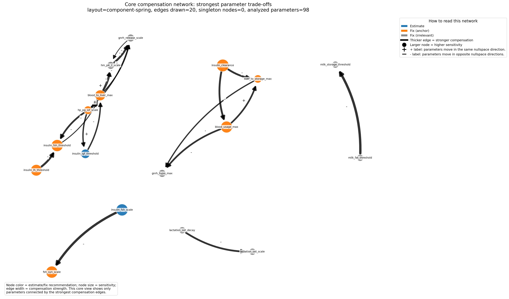

The compensation network visualizes the strongest parameter trade-offs extracted from weak SVD directions. Each node is a parameter, and each edge indicates that two parameters can compensate for each other in the local sensitivity structure.

Node color shows the estimate/fix recommendation:

- blue = estimate candidate
- orange = fixed anchor
- gray = fixed irrelevant

Node size shows sensitivity, and edge width shows compensation strength. Large, highly connected nodes are especially important because they are influential but also involved in parameter trade-offs.

Strong compensation relationships include pairs such as:

- fsh_syn_scale with insulin_fsh_scale
- blood_usage_max with insulin_clearance
- insulin_clearance with insulin_fsh_threshold
- hp_pg_iof_scale with hp_enz_pg_scale
- milk_fat_threshold with milk_storage_threshold
- lactation_oxt_decay with fat_mobilization_storage_threshold

These pairings indicate directions where changes in one parameter can be partly offset by changes in another. Such parameters should not be estimated together without additional information, stronger priors, anchoring, or a more informative experimental design.

---

## 6. Parameter Scenario Map

Parameter scenario map

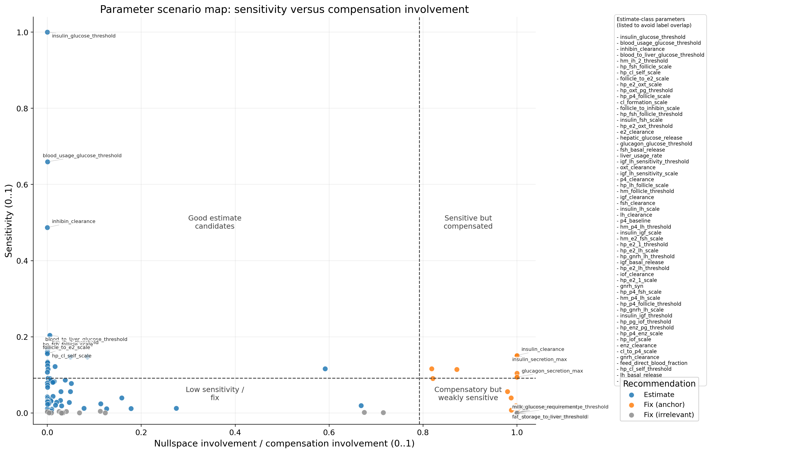

The parameter scenario map is the main all-parameter diagnostic. It replaces the unreadable all-parameter network because it shows all parameters without forcing every parameter into a crowded graph.

Each point is one analyzed parameter. The x-axis shows nullspace or compensation involvement, and the y-axis shows local sensitivity. This separates four practical cases:

1. Sensitive and weakly compensated  
   These are the best estimate candidates.

2. Sensitive but highly compensated  
   These parameters are important but risky to estimate freely because other parameters can mimic their effects.

3. Low sensitivity  
   These parameters are poor calibration targets in the current experiment and should usually remain fixed.

4. Compensatory but weakly sensitive  
   These parameters participate in weak directions but do not strongly affect the selected outputs. They are poor candidates for estimation unless a new experiment is designed to excite them.

This figure is especially useful because it summarizes the practical modelling decision: estimate, fix as anchor, or fix as low-information.

---

## 7. Profile Likelihood Confirmation

Profile likelihood was used as a nonlinear confirmation step after the local SVD identifiability screen. The SVD analysis provides a local linear approximation of parameter identifiability near the nominal parameter set, whereas profile likelihood evaluates whether parameters remain practically identifiable when varied over a broader range while nuisance parameters are allowed to re-optimize.

The 60 parameters classified as Estimate candidates by the SVD screen were profiled against synthetic measurable outputs (FSH, PGF, P4, E2, INH, IGF1, Insulin, Glucose, Glucagon). The resulting practical identifiability classes were:

- 51 practically identifiable
- 6 boundary-limited
- 1 weakly identifiable
- 2 flat/non-identifiable

The representative 3×3 panel summarizes the main practical outcomes of nonlinear profiling.

Representative profile likelihood classes:

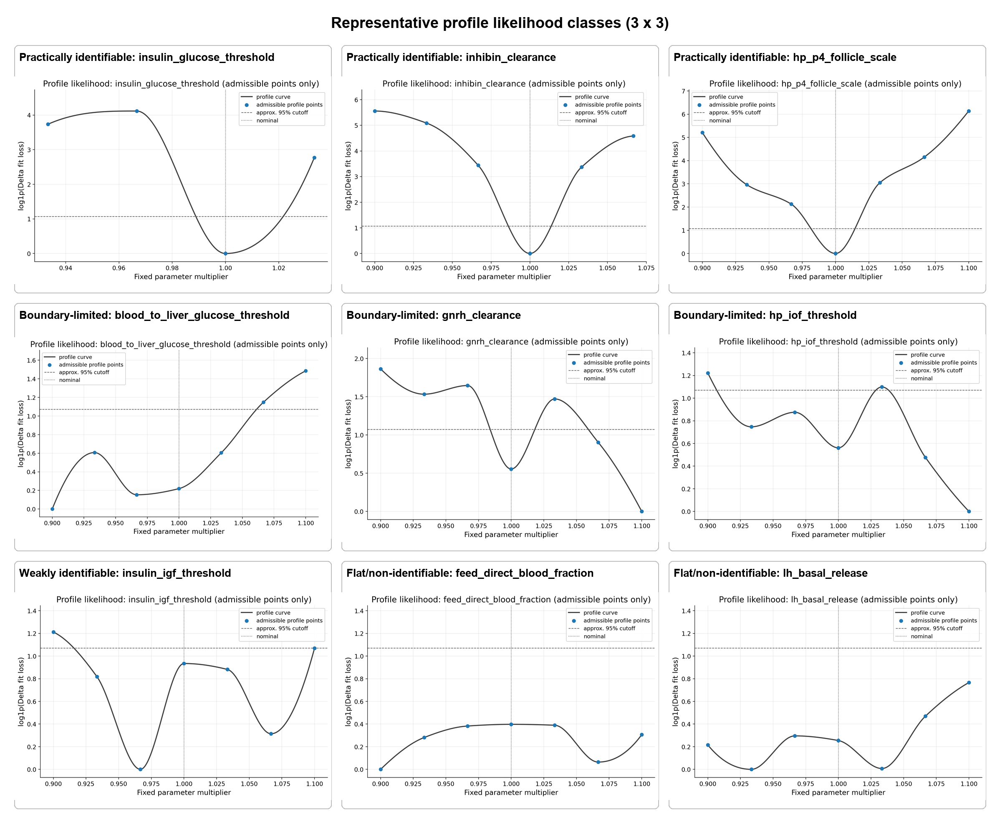

The top row shows representative practically identifiable parameters (insulin_glucose_threshold, inhibin_clearance, hp_p4_follicle_scale) with clear profile minima and likelihood increases on both sides of the optimum. These parameters appear sufficiently constrained by the current measurement panel and support the SVD prediction that a substantial subset of selected parameters is estimable.

The middle row illustrates boundary-limited cases (blood_to_liver_glucose_threshold, gnrh_clearance, hp_iof_threshold). These parameters exhibit local profile curvature but remain incompletely bounded within the explored range. A particularly informative example is blood_to_liver_glucose_threshold, which was classified by the SVD screen as an Estimate candidate due to moderate sensitivity and very low nullspace participation. However, profile likelihood revealed that one side of the profile remained insufficiently constrained, indicating that the parameter is locally informative but not yet fully bounded under the current experimental setup. This suggests that broader profile ranges, additional measurements, or more informative sampling strategies may be required for robust estimation.

The bottom row demonstrates two qualitatively different failure modes. insulin_igf_threshold represents a weakly identifiable parameter, where some profile curvature exists but a broad region remains acceptable. In contrast, feed_direct_blood_fraction and lh_basal_release exhibit flat/non-identifiable profiles, where substantial parameter changes produce only weak deterioration in fit quality. The case of lh_basal_release is particularly informative because the SVD screen initially classified it as an Estimate candidate, indicating that small local perturbations around the nominal parameter set appeared detectable. However, nonlinear profiling showed that the available measurable outputs do not sufficiently constrain the parameter over a realistic range, demonstrating that local identifiability does not necessarily imply practical identifiability.

Overall, the comparison between SVD and profile likelihood supports a sequential interpretation of identifiability. The local SVD screen acts as an efficient screening tool that identifies promising parameter candidates and weak directions, whereas profile likelihood provides the nonlinear confirmation step needed to determine whether parameters are truly bounded by the available data. In this workflow, SVD efficiently reduced the candidate parameter space, while profile likelihood refined these candidates into practically identifiable, boundary-limited, weakly identifiable, and non-identifiable classes. This combination increases confidence that selected calibration targets are scientifically defensible and highlights where additional experimental information would be most valuable.

## 8. Global Sensitivity And Admissible-Bank Association

Global sensitivity was added as a complementary diagnostic after the local sensitivity and identifiability analyses. Local sensitivity tested one-at-a-time effects near the nominal parameter set, while the global screening asks whether the same or different parameters are associated with biomarker variability across simulation-bank ensembles.

The analysis used the same observable biomarker panel as BED:

`FSH, PGF, P4, E2, INH, IGF1, Insulin, Glucose`

Two related but distinct analyses were performed:

1. A full-prior variance-based screening using the 10,000 unfiltered Monte Carlo simulations.
2. A PRCC/Spearman association analysis using the 7,874 biologically admissible simulations.

Because the unfiltered bank was generated using ordinary Monte Carlo sampling rather than a Saltelli/Sobol design, these results are not labelled as strict Sobol indices.

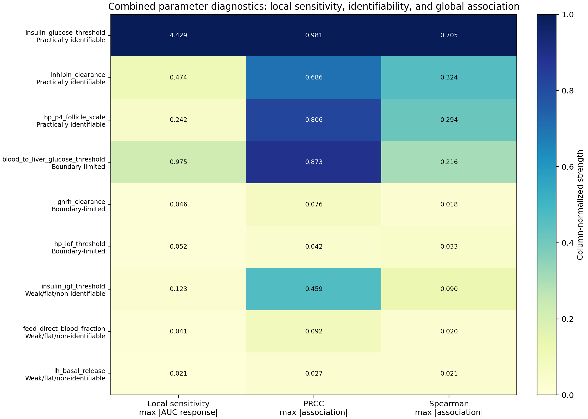

 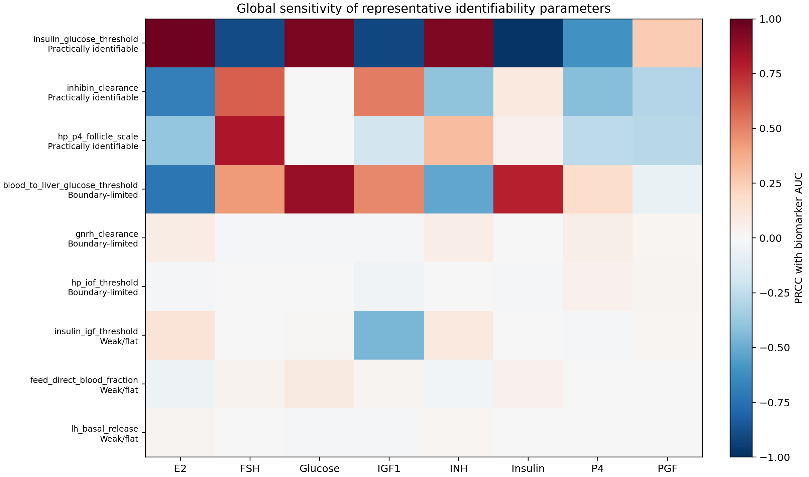

## 9. Uncertainty Analysis

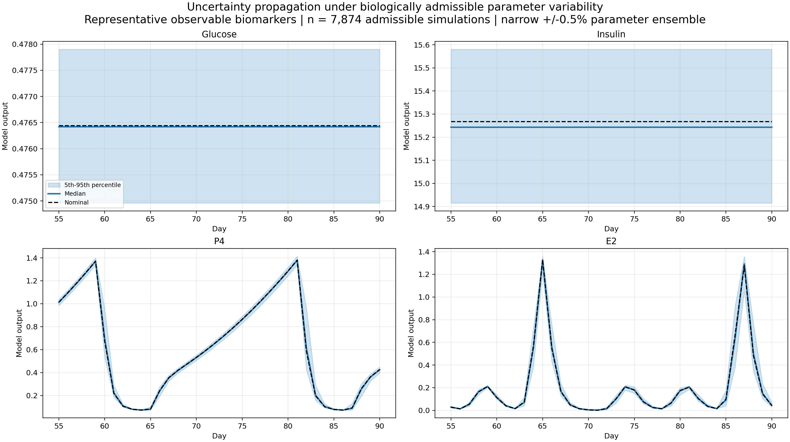

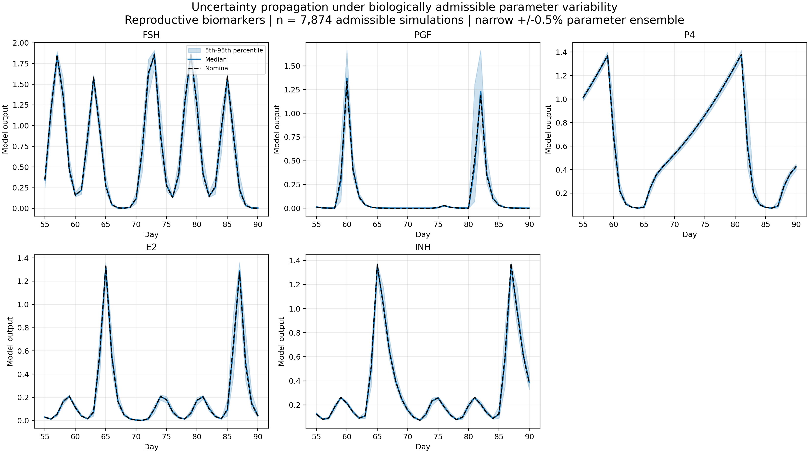
 
## 8. Bayesian Experimental Design

This figure illustrates how Bayesian experimental design (BED) acts as the constructive follow-up to identifiability analysis. Sensitivity, SVD identifiability, nullspace participation, compensation analysis, and profile likelihood identify which parameter directions remain weakly informed or confounded under the current measurement panel. BED then addresses the next scientific question:

If some parameters are weakly identifiable, which measurements would make them more identifiable? 

The upper panel shows the endocrine-metabolic cycle dynamics and the expected information gain across candidate sampling days. Information content is not constant across the trajectory. Instead, it changes with biological phase because parameter influence becomes stronger or weaker depending on system dynamics. In this example, day 68 (red bar) represents a relatively low-information sampling point, whereas day 83 (black bar) corresponds to a high-information region of the cycle.

This result links directly to identifiability. A parameter may appear weakly identifiable or boundary-limited not because the model structure is fundamentally flawed, but because the current observations are collected at biologically uninformative times. The SVD and profile-likelihood analyses diagnose these weak directions; BED proposes where additional measurements would most efficiently reduce them.

The lower-left panel further decomposes information content across measured species. Reproductive endocrine markers such as PGF, E2, FSH, and INH contribute substantially more information for the target parameter than metabolic outputs such as glucose, glucagon, or insulin. This finding provides a mechanistic explanation for some identifiability limitations observed in the SVD and profile-likelihood analyses. Parameters embedded in reproductive pathways are more likely to become practically identifiable when reproductive species are measured during informative phases of the cycle.

The lower-right panel demonstrates the practical consequence of informative measurements through prior-to-posterior updating. The blue curve represents the prior uncertainty for the target parameter. Posterior distributions obtained from low-information observations (for example, measurements near day 68) remain broad and similar to the prior, indicating limited uncertainty reduction. In contrast, measurements collected at highly informative sampling times (for example, day 83) and using informative species produce substantially narrower posterior distributions. This corresponds to stronger parameter constraint and improved practical identifiability.

The scientific take-home message is therefore:

Identifiability analysis diagnoses where the model is weakly informed. Bayesian experimental design proposes how future experiments can repair those weaknesses. 

In practical terms, parameters classified as weakly identifiable, boundary-limited, or strongly involved in nullspace compensation should not automatically be discarded. Instead, BED provides a principled strategy to improve their estimability by selecting more informative sampling times and measured species. This turns identifiability analysis from a purely diagnostic exercise into a constructive experimental-design workflow.

## 9. Dexa Perturbation Validation

The Python Dexa runner implements the optional 25-state extension from the
MATLAB v3 Dexa model. The first 22 states remain the MetRep core model; the
additional states represent the intramuscular depot amount, central/systemic
amount, and effect-site concentration of dexamethasone.

The curated example uses the non-lactating standard scenario with a day-0 dose
of 0.02 mg/kg in a 600 kg cow, matching the MATLAB reference dose logic. The
figure compares the Dexa trajectory with the matching no-Dexa baseline. The
short response table reports the largest Dexa-baseline differences for the
plotted states.

In this 3-day perturbation, the Dexa PK/PD module produces a rapid effect-site
concentration peak and a clear metabolic response. Glucose, insulin, and
glucagon deviate from the no-Dexa baseline after dosing, while reproductive
states such as P4 change only modestly over this short window. This is
consistent with using Dexa as a pharmacological metabolic challenge rather
than as a replacement for the baseline reproductive-cycle simulation.

Dexa is intentionally separated from identifiability analysis. Local
sensitivity, SVD, and profile-likelihood workflows use the 98-parameter
non-Dexa core model. The Dexa PK/PD constants are fixed in the optional Dexa
runner and are not included in the SVD/nullspace parameter list.

## 10. Surrogate BED thesis-style summary

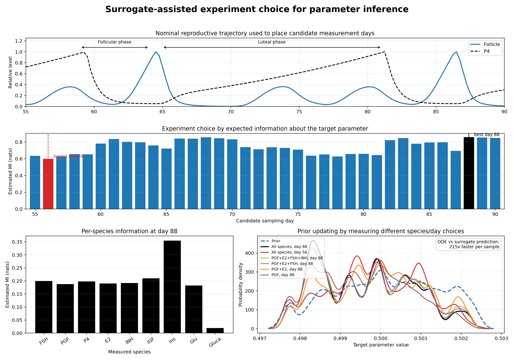

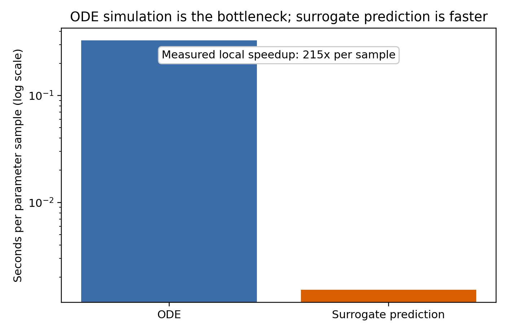

The surrogate BED pilot uses the translated Python ODE model to generate a local Monte Carlo prior around the nominal parameter set, retains biologically admissible trajectories, trains an ExtraTrees surrogate on ODE output features, and evaluates candidate measurements using mutual information and posterior reweighting.

In this pilot run, 389 biologically admissible samples remained from 500 ODE simulations. For the target parameter insulin_glucose_threshold, the highest all-species candidate was day 88, while the lowest all-species candidate was day 56. The top trajectory panel places these candidate days in the nominal follicle/P4 cycle. The middle panel ranks candidate sampling days by estimated mutual information. The lower-left panel decomposes the day-88 information by species. The lower-right panel shows how different measurement choices reshape the prior into posterior densities by likelihood-weighted reweighting.

This BED result should be labelled as a surrogate pilot, not as the final thesis-level BED result. It is useful for reproducing the structure of the PhD analysis in Python, but a final public BED claim should use more ODE training samples and demonstrate stable surrogate validation, mutual-information convergence, and candidate-ranking robustness.

The scientific workflow is therefore sequential:

1. Sensitivity identifies parameters that affect outputs.
2. SVD identifies informed and weak directions.
3. Compensation analysis explains which parameters are confounded.
4. Profile likelihood confirms nonlinear identifiability behaviour.
5. BED proposes future measurements to reduce uncertainty.

---

# Appendix / Diagnostic Figures

The following figures are useful for technical checking and transparency, but they are not needed in the main narrative.

## Appendix A. Full Baseline State Panel

Baseline all model states

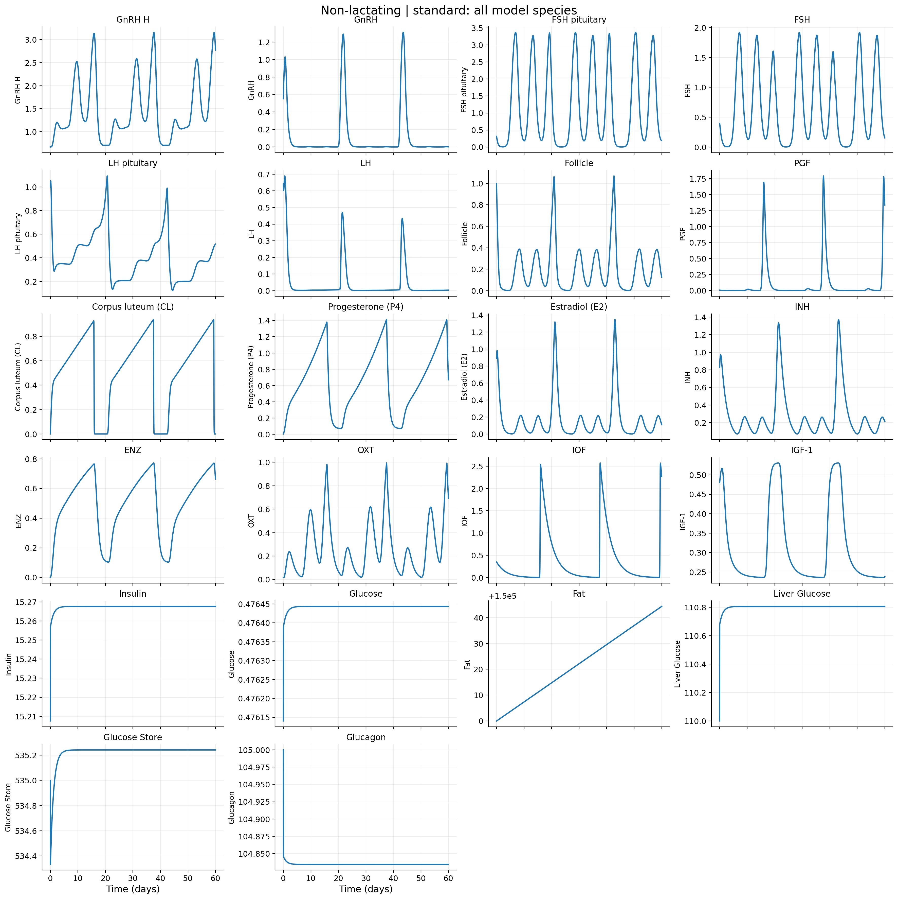

The all-state baseline panel shows every model state in the translated 22-state Python implementation. This figure is useful for confirming that no state is silently missing, unstable, or incorrectly mapped. It is placed in the appendix because it is too dense for the main results.

---

## Appendix B. SVD Sensitivity Ranking

SVD ranking

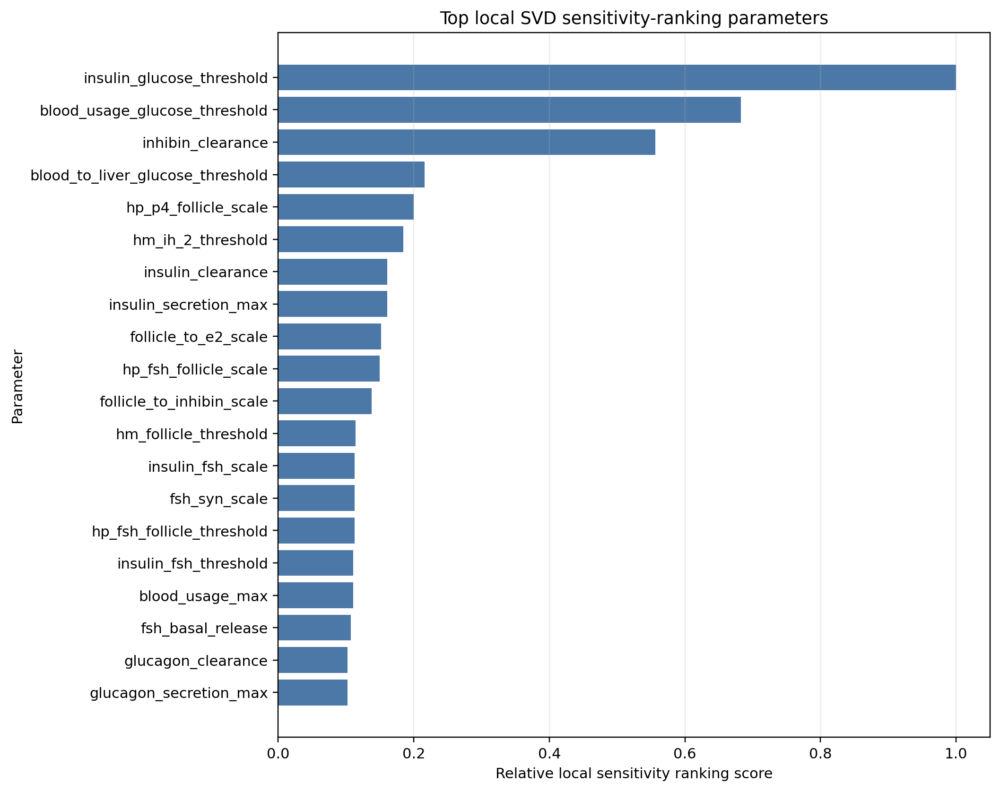

The SVD ranking summarizes which parameters contribute most strongly to the local trajectory sensitivity matrix after scaling by parameter and output magnitude. This ranking is related to, but not identical to, the AUC-based local sensitivity ranking.

The AUC sensitivity ranking asks: which parameters change cumulative output exposure?

The SVD ranking asks: which parameters change the full time-resolved trajectory sensitivity matrix?

Therefore, parameters that change pulse timing, oscillation shape, or trajectory patterns can rank highly in the SVD score even if their AUC effect is less dominant. The highest-ranked parameters should not automatically be selected for estimation; they must also be checked for nullspace participation and compensation.

---

## Appendix C. Full Nullspace Participation Ranking

All-parameter nullspace participation

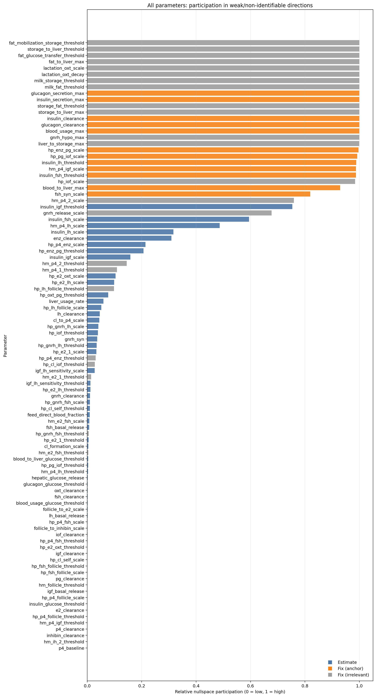

This plot ranks all parameters by participation in weak or non-identifiable SVD directions. High values indicate parameters that appear strongly in poorly informed directions.

The figure is useful for model debugging and detailed parameter review, but it contains many parameter names and is visually dense. The parameter scenario map in the main results summarizes the same concept more clearly.

---

## Appendix D. Strongest Compensation Pairs

Compensation pairs

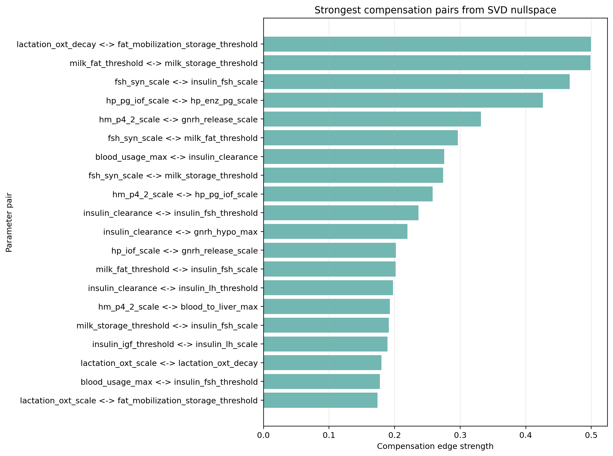

This barplot ranks the strongest compensation pairs extracted from weak SVD directions. It provides a quantitative counterpart to the compensation network. Since the network is more intuitive for the main narrative, this pair-ranking plot is kept in the appendix.

---

## Appendix E. Sensitivity Ranked by Class

Sensitivity ranked by class

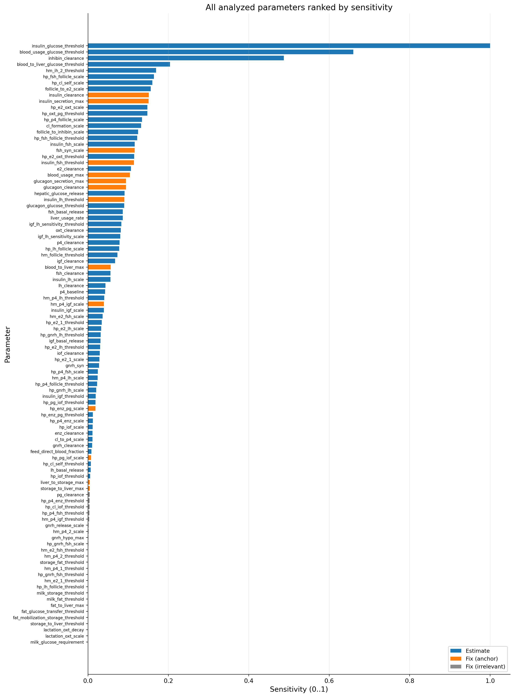

This plot shows all analyzed parameters ranked by sensitivity and colored by recommendation class. It is useful for checking whether a fixed parameter was fixed because it is low-sensitivity or because it is sensitive but confounded. It is placed in the appendix because the full list of parameters is too dense for the main results.

---

## Appendix F. ODE versus Surrogate Speed

ODE versus surrogate speed

The speed comparison was measured locally using 12 ODE simulations and 200 repeated surrogate predictions on the same number of parameter samples. The ODE solver required 0.327 seconds per sample, while surrogate prediction required 0.00152 seconds per sample, giving an observed prediction speedup of about 215x.

This figure is useful for the computational engineering story because it explains why a surrogate is useful for BED candidate exploration. For a biological modelling paper, it can remain in the appendix. For a GitHub or AI-engineering portfolio, it can also be shown in the main text.

## Appendix G. Top PRCC Parameter-Biomarker Associations

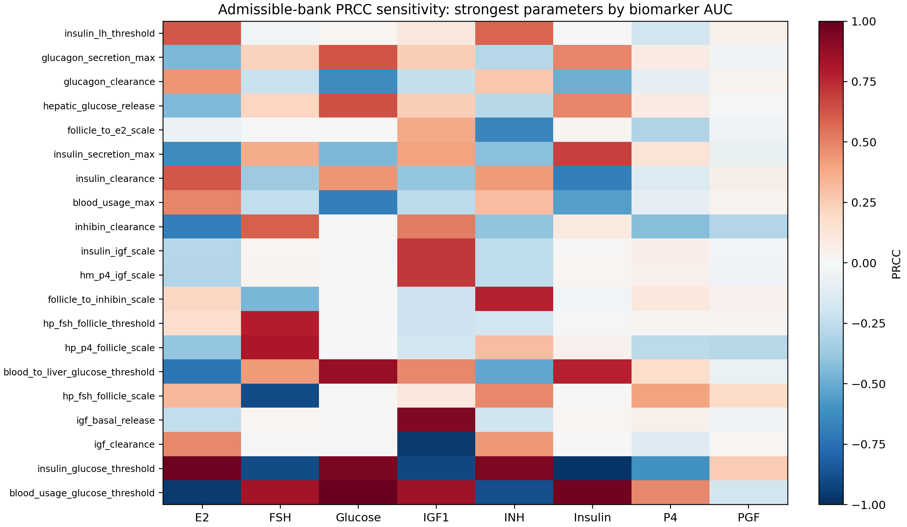

## Appendix H. All-Biomarker Uncertainty Propagation

