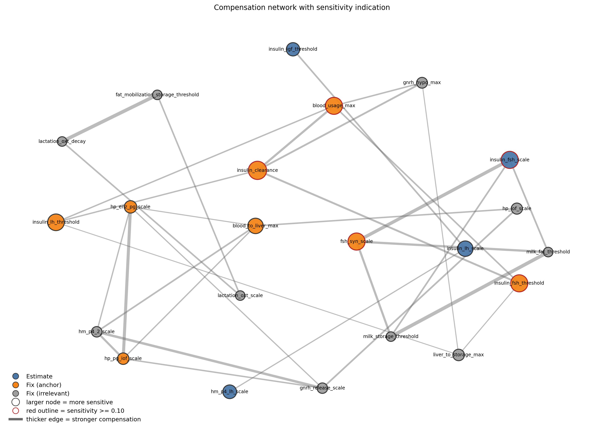
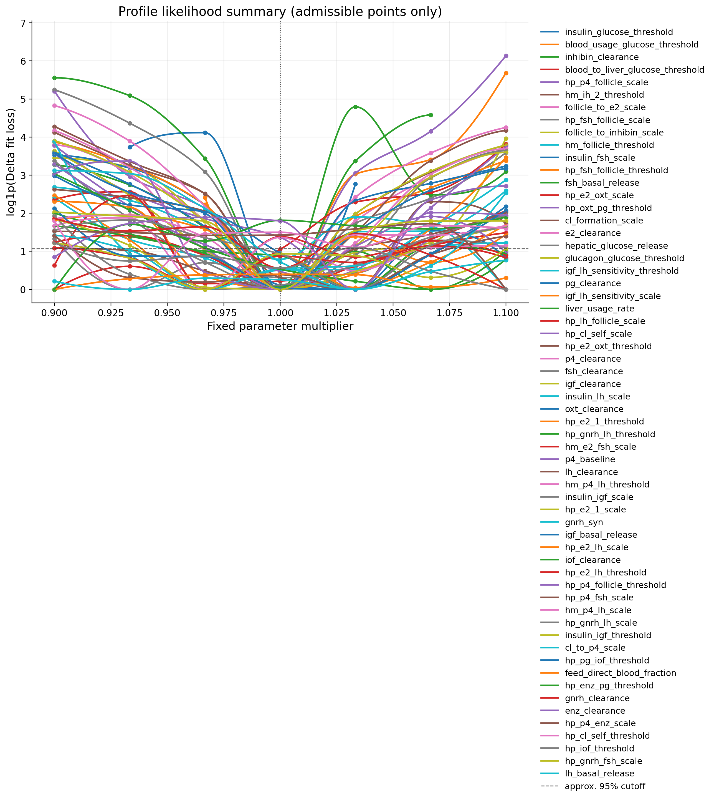
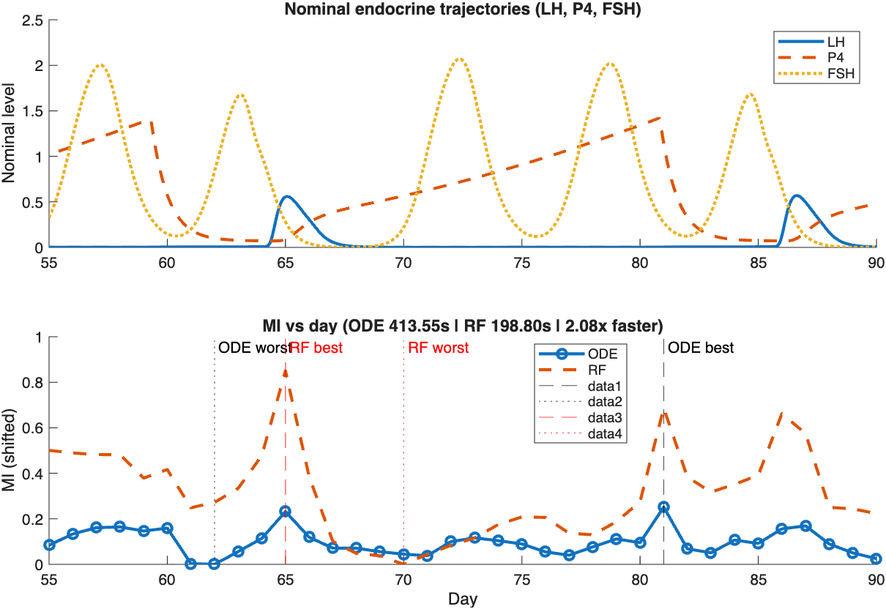
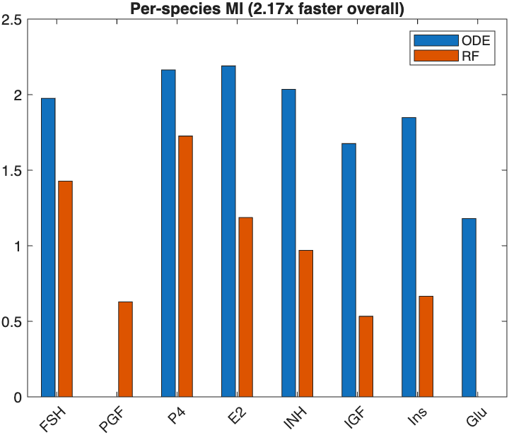
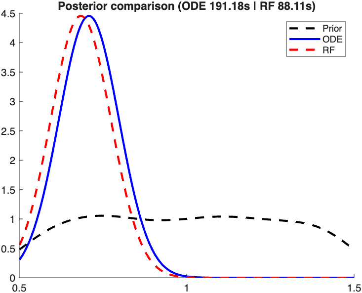

# Results Summary

This repository curates the Python sensitivity and identifiability outputs for
the MetRep metabolic-reproductive model. The full scenario simulations are
reported in the MetRep model paper, the Dexa perturbation scenario is reported
in the Dexa paper, and the full Bayesian experimental design analysis is
reported in the PhD thesis.

For technical definitions and formulas, see:

- `docs/sensitivity_identifiability.md`
- `docs/plot_interpretation_guide.md`
- `docs/bayesian_experimental_design.md`

## Result Set

| Step | Main question | Curated output |
|---|---|---|
| Python validation | Does the Python translation preserve MATLAB metadata? | `results_final/tables/validation_report.csv` |
| Baseline run | Does the translated model produce baseline trajectories? | `results_final/figures/baseline_selected_states.png` |
| Sensitivity | Which parameters most strongly affect selected outputs? | `results_final/tables/sensitivity_top_parameters.csv`, `results_final/figures/sensitivity_top_parameters.png` |
| SVD identifiability | Which parameter directions are informed or weak? | `results_final/figures/identifiability_singular_values.png`, `results_final/figures/identifiability_svd_ranking.png` |
| SVD classes | Which parameters should be estimated, anchored, or fixed? | `results_final/tables/structid_50d_measurable_holistic_table.csv`, `results_final/figures/identifiability_decision_map.png`, `results_final/figures/identifiability_class_counts.png` |
| Compensation | Which parameters can compensate each other? | `results_final/tables/structid_50d_measurable_compensation_edges.csv`, `results_final/figures/identifiability_compensation_edges.png`, `results_final/figures/identifiability_compensation_network_sensitivity.png` |
| Profile likelihood | Which selected parameters remain practically identifiable after nonlinear profiling? | `results_final/tables/profile_50d_balanced_relaxed_summary.csv`, `results_final/figures/profile_50d_balanced_relaxed_combined_profiles.png` |
| BED context | Which sampling days/species are expected to be informative? | `results_final/figures/bed_MI.png`, `results_final/figures/bed_MI_Individual_Species.png`, `results_final/figures/bed_Posteriors.png` |

## Baseline And Sensitivity

The baseline simulation is used as a functional check of the translated Python
model before analysis. It is not itself an identifiability test; it establishes
that the model produces trajectories for the selected metabolic and
reproductive states.

The local sensitivity screen shows that the strongest AUC-level responses are
concentrated in insulin/glucose regulation, IGF dynamics, and reproductive
steroid-related parameters. The largest absolute relative sensitivity in the
curated table is `insulin_glucose_threshold` acting on insulin AUC
(`4.43`), followed by `blood_usage_glucose_threshold` acting on insulin AUC
(`3.08`). Other high-ranking parameters include
`blood_to_liver_glucose_threshold`, `igf_clearance`, `cl_to_p4_scale`,
`cl_formation_scale`, `insulin_secretion_max`, and `insulin_clearance`.

This result indicates that the selected outputs are responsive to both
metabolic control parameters and reproductive endocrine parameters. However,
sensitivity alone is not sufficient for estimation. A parameter can produce a
large output response and still be difficult to estimate if another parameter
can compensate for it.

## SVD Identifiability

The SVD ranking summarizes which parameters contribute most strongly to the
local trajectory sensitivity matrix after scaling by parameter and output
magnitude. The highest-ranked parameters are not automatically selected for
estimation; they must also be checked for nullspace participation.

The singular-value spectrum shows a large separation between the strongest
informed directions and the weakest directions. In the curated singular-value
table, the largest singular value is about `1.27e3`, while the smallest values
fall to about `9.04e-14`. This numerical spread supports the conclusion that
the current measurement set informs some parameter combinations strongly but
leaves other combinations weakly determined.

The biological interpretation is not that the whole model is identifiable or
non-identifiable. Instead, the selected outputs provide information about some
directions in parameter space, while other directions remain ambiguous under
the local linear approximation.

## Estimate, Anchor, And Irrelevant Classes

Using measurable outputs `FSH, PGF, P4, E2, INH, IGF1, Insulin, Glucose,
Glucagon`, the SVD screen classified the analyzed parameters as:

- 60 `Estimate`
- 12 `Fix (anchor)`
- 25 `Fix (irrelevant)`

The `Estimate` group contains parameters that are sensitive enough and have low
enough nullspace participation to be reasonable calibration/profile-likelihood
candidates. Examples near the top of the holistic table include
`insulin_glucose_threshold`, `blood_usage_glucose_threshold`,
`inhibin_clearance`, `blood_to_liver_glucose_threshold`,
`hp_p4_follicle_scale`, and `hm_ih_2_threshold`.

The `Fix (anchor)` group contains parameters that retain output influence but
also participate strongly in weak or compensatory directions. Examples include
`insulin_clearance`, `insulin_secretion_max`, `fsh_syn_scale`,
`insulin_fsh_threshold`, `blood_usage_max`, `glucagon_clearance`, and
`glucagon_secretion_max`. These parameters are scientifically important, but
the current output panel does not separate them cleanly enough to estimate all
of them freely together.

The `Fix (irrelevant)` label should be interpreted only within this analysis
setting. It does not mean biologically irrelevant. It means that, for the
selected outputs and simulation window, the parameter has low local output
influence and therefore should not be estimated from this dataset. Several
lactation/storage threshold parameters fall into this group because their
sensitivity is near zero in this non-lactating baseline setting while their
nullspace participation is high.

## Nullspace And Compensation

The all-parameter nullspace plot shows which parameters participate most in
weak directions. The sensitivity/nullspace map then separates two cases that
need different scientific treatment:

- sensitive parameters with low nullspace participation are supported by the
  current outputs and are better candidates for estimation;
- sensitive parameters with high nullspace participation are influential but
  confounded, so they are better treated as anchors or constrained by prior
  knowledge;
- low-sensitivity parameters with high nullspace participation are weakly
  informed under the current output panel and should remain fixed unless a new
  experiment is designed to target them.

The compensation analysis identifies pairs of parameters that appear together
in weak SVD directions. Strong pairings in the curated table include:

- `lactation_oxt_decay` with `fat_mobilization_storage_threshold`
- `milk_fat_threshold` with `milk_storage_threshold`
- `fsh_syn_scale` with `insulin_fsh_scale`
- `hp_pg_iof_scale` with `hp_enz_pg_scale`
- `blood_usage_max` with `insulin_clearance`
- `insulin_clearance` with `insulin_fsh_threshold`

These pairings indicate directions where changes in one parameter can be
partly offset by changes in another. The sensitivity-aware network adds an
important distinction: large or highlighted nodes are parameters that affect
the measured outputs, while edges indicate compensation structure. Parameters
that are both sensitive and strongly connected are the most important targets
for anchoring, prior constraints, or Bayesian experimental design.

## Profile Likelihood Confirmation

Profile likelihood was used as a nonlinear confirmation step after the local
SVD screen. The 60 selected `Estimate` parameters were profiled against
synthetic measurable outputs while nuisance parameters were allowed to
compensate.

The profile-likelihood classes were:

- 51 practically identifiable
- 6 boundary-limited
- 1 weakly identifiable
- 2 flat/non-identifiable

The 51 practically identifiable parameters have profile curves with clear
enough minima inside the tested range. This supports the SVD decision that a
substantial subset of the selected parameters is estimable from the current
output panel.

The 6 boundary-limited parameters had their best profile point at the edge of
the tested range: `blood_to_liver_glucose_threshold`,
`igf_lh_sensitivity_threshold`, `hp_enz_pg_threshold`, `gnrh_clearance`,
`hp_p4_enz_scale`, and `hp_iof_threshold`. These parameters should not be
claimed as fully bounded without either a wider profile range or additional
information.

The weakly identifiable parameter was `insulin_igf_threshold`. Its profile had
some curvature, but a broad part of the tested range remained acceptable. The
flat/non-identifiable parameters were `feed_direct_blood_fraction` and
`lh_basal_release`; their tested changes did not increase the loss enough to
support reliable estimation under the current output panel.

## Bayesian Experimental Design Link

The BED figures are included as context from the PhD workflow. They should be
read as the constructive follow-up to the identifiability analysis. Sensitivity,
SVD, compensation, and profile likelihood identify which parameters or
directions are insufficiently informed; BED evaluates which candidate sampling
days and measured species are expected to reduce that uncertainty.

In the BED workflow, posterior distributions were obtained by reweighting prior
parameter samples with a Gaussian likelihood from a fixed synthetic
observation. Mutual information was then used to rank candidate observations by
their expected information about the target. The posterior plots therefore
show how an informative measurement can narrow uncertainty, while the mutual
information plots rank which candidate measurements are expected to be most
useful before collecting new data.

Scientifically, this makes the workflow sequential: the classical analysis
defines the information gap, and BED proposes how future experiments could
reduce that gap.

## Publication-Reported Results

- MetRep scenario simulations: reported in the MetRep model paper.
- Dexa perturbation simulation/validation: reported in the Dexa paper.
- Bayesian experimental design: reported in the PhD thesis; selected figures
  are included in `results_final/figures/` for context.
